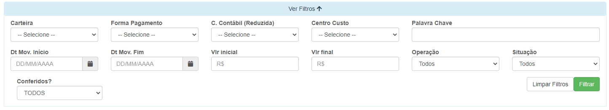
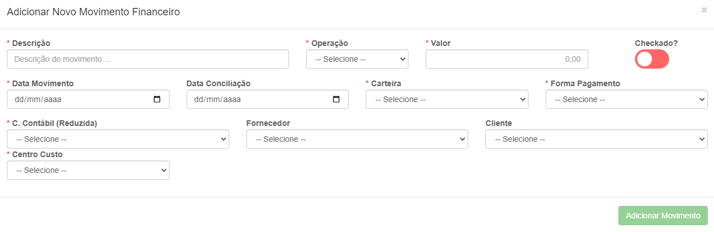
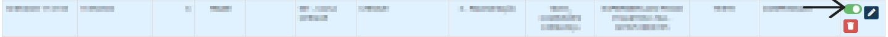

# Movimento Financeiro
**Campo com a função de gerenciar o movimento de pagamentos**
***

#### **Campos para filtro :**

* `Carteira` - Informe a carteira da conta que deseja procurar
* `Forma de Pagamento` - Selecione a forma de pagamento da conta que procura
* `Conta Contábil (Reduzida)` - Informe qual é o tipo da conta que deseja procurar
* `Centro Custo` - Informe o tipo de centro de custo da conta que pretende procurar
* `Palavra Chave` - Insira uma palavra chave para facilitar a procura da conta que deseja procurar
* `Data de Movimento Inicio` - Informe a data de inicio de movimento das contas que pretende procurar
* `Data de Movimento Fim` - Informe a data final dos movimentos da contas
* `Valor Inicial` - Insira um valor mínimo das contas que deseja procurar
* `Valor Final` - Insira o valor máximo das contas
* `Operação` - Informe a operação da conta| **Crédito e Débito**
* `Situação` - Selecione a situação das contas| **Compensado e À Compensar**
* `Conferidos?` - Informe se a conta é ou não conferidos

***

## Fazer o Movimento Manualmente

#### **Campos para preencher :**

* `Descrição` - Dê uma descrição para o movimento
* `Operação` - Selecione o tipo de pagamento da conta| **Crédito e Débito**
* `Valor` - Insira o valor da conta
* `Data de Movimento` - Informe a data de movimento
* `Data de Conciliação` - Informe a data de Conciliação da conta
* `Carteira` - Informe a carteira da conta  
* `Formas de Pagamento` - Selecione o meio de pagamento da conta
* `Conta Contábil` - Selecione o tipo da conta
* `Fornecedor` - Insira o fornecedor da conta
* `Cliente` - Informe o cliente da conta
* `Centro Custo` - Selecione o tipo do centro de custo da conta

***
## **Listagem dos Movimentos**
 

* `Campos em Azul` - **Campos em Azul são pagamentos feitos em Crédito**
* `Campos em Vermelho` - **Campos em Vermelho são pagamento feitos em Débito**
***

### **Conferir Movimentos :**
 

 
**Assinale a opção para qonfeiri um movimento**