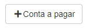
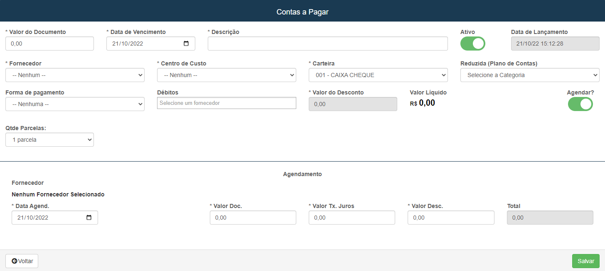
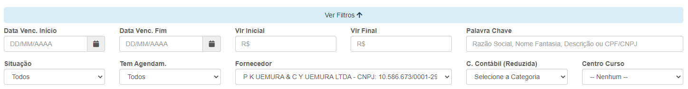
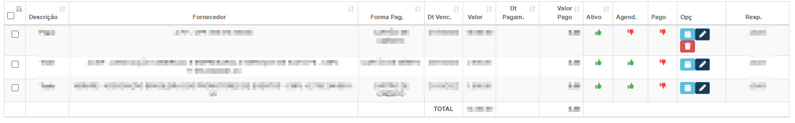
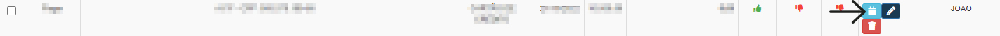
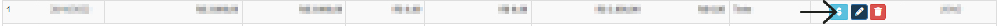
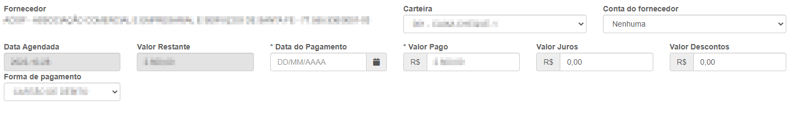
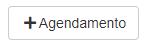
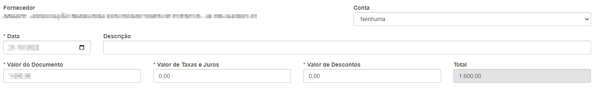

# Contas a Pagar
**Campos com a função de gerenciar contas que já ou ainda não forma pagos**
***

### Nova Conta

#### **Campos para cadastro :**

* `Valor do Documento` - Insira um valor para conta
* `Data de Vencimento` - Informe a data de vencimento do pagamento
* `Descrição` - Dê uma descrição para a conta
* `Data de Lançamento` - Data de qunato a conta foi lançada| **Preenchido Automaticamente**
* `Fornecedor` - Selecione o fornecedor para pagamento
* `Centro de Custo` - Informe o centro de custo desta conta
* `Carteira` - Informe a carteira de onde vem essa conta
* `Reduzida (Plano de Contas)` - Selecione qual é o tipo desta conta
* `Forma de Pagamento` - Insira a forma de pagamento
* `Débitos` - Selecione um fornecedor
* `Quantidade de Parcelas` - Informe a quantidade de parcelas dessa conta
* `Agendar` - Informe se a conta está agendada para pagamento
***
1. Agendar
    - `Data de Agendamento` - Informe uma data para o pagamento
    - `Valor do Documento` - Insira o valor da conta| **Preenchido instantaneamente após inserir um valor na conta**
    - `Valor da Taxa de Juros` - Insira um valor para taxas de juros| **Caso Precise**
    - `Valor Desconto` - Insire um valor para desconto| **Caso Precise**
    - `Total` - Valor total da conta

***

## Campos para Pesquisa :

* `Data de Vencimento Inicio` - Insira um data de inicio para o vencimento das contas
* `Data de Vencimento Fim` - Insira uma data de fim para vencimento das contas
* `Valor Inicial` - Insira um valor inicial para pesquisa de uma certa conta
* `Valor Final` - Insira um valor máximo para pesquisa
* `Palavra Chave` - Informe uma palavra chave para facilitar a busca da conta
* `Situação` - Informe qual é a situação da conta| **Todos, Pagos e Em Abertos**
* `Tem Agendamento` - Selecione se a conta tem agendamentos| **Todos, Sim e Não**
* `Fornecedor` - Selecione o fornecedor da conta que deseja procurar
* `Conta Contábil (Reduzida)` - Informe o tipo da conta
* `Centro de Cunsto` - Selecione o centro de custo da conta que deseja procurar

***
 

### **Listagem de contas :**

***

## Pagar conta

* **Após entrar uma nova abá aparecerá com informções da conta**

* **Após clicar você sera redirecionado para uma nova abá**

### Pagamento

**Você sera redirecionado para uma outra abá ondo você poderá verificar as informaçoes do pagamneto**
***

#### **Campos para revisar**

* `Carteira` - Verifique se a carteira é a mesma que foi selecionada na conta
* `Conta do Fornecedor` - Informe a conta do fornecedor
* `Data Agendada` - Confira se éssa foi a data agendada
* `Valor Restante` - Confira o valor que ainda resta
* `Data do Pagamento` - Insira a data de quanto houve o pagamento
* `Valor Pago` - Confirme se este foi realmente o valor pago
* `Valor Juros` - Insire um valor de juros| **Caso for preciso**
* `Valor Descontos` - Insire um valor de desconto| **Caso for preciso**
* `Forma de Pagamento` - Verifique se a forma de pagamento está correta

* **Após a verficação salve e logo após o pagamento será efetuado**
***

## Criar Agendamento Para uma Conta

**Logo após acessar essa opção você será redirecionado para uma nova abá**

### Novo Agendamento

#### **Campos para Cadastro :**

* `Conta` - Informe a conta do fornecedor
* `Data` - Insira uma data para o agendamento
* `Descrição` - Dê uma descrição para o agendamento
* `Valor do Documento` - Verifique o valo do documento
* `Valor de Taxas de Juros` - Insira uma taxa pra os juros| **Caso precise**
* `Valor de Desconto` - Insira um valor para desconto| **Caso precise**
* `Total` - Valor total da conta

***

## Log de Transação
**Ao entrar em alguma abá, logo abaixo exitirá uma opção chamada de log de transação. É usado para a verificação de alterações na conta**

