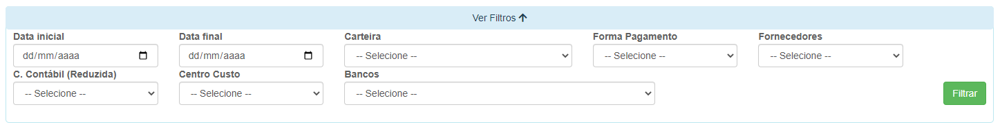
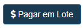
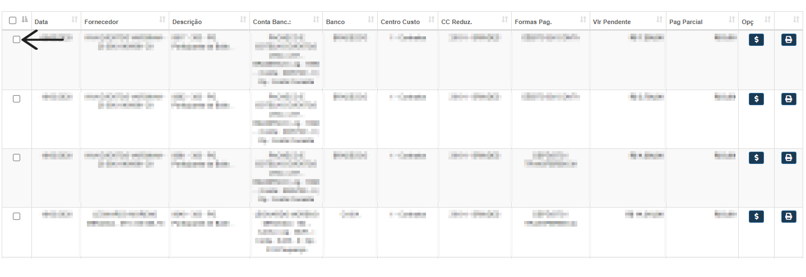
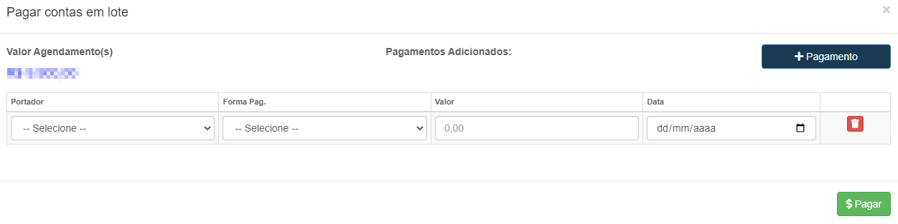
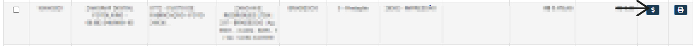
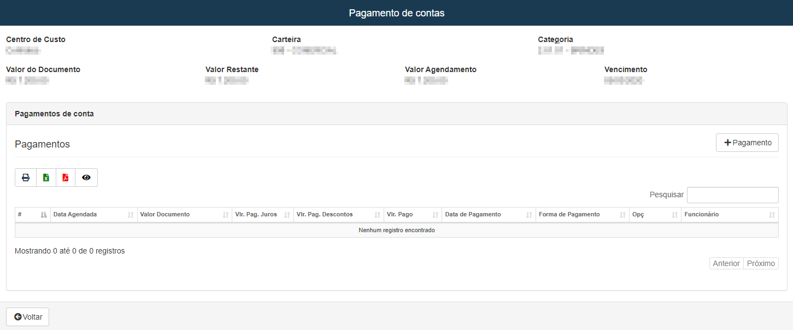
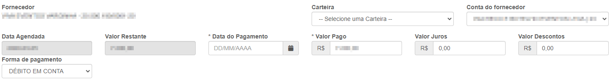

# Programação de Pagamento
**Campo com a função de gerenciar e realizar pagamentos**
***

#### **Campos para Pesquisa :**

* `Data Inicial` - Informe uma data mínima de pagamentos
* `Data Final` - Informe uma data máxima para os pagamentos
* `Carteira` - Selecione a carteira do pagamento
* `Formas de Pagamento` - Informe a forma de pagamento
* `Fornecedores` - Selecione o fornecedor do pagamentos que deseja procurar
* `Conta Contábil (Reduzida)` - Informe o tipo de pagamento
* `Centro de Custo` - Informe o centro de custo do pagamento que deseja procurar
* `Bancos` - Selecione o banco do pagamento

***

## Pagar em Lote: 

* **Asinale os pagamentos que deseja fazer e logo após clique em pagar em lote, após isso uma nova abá aparacerá**

### Novo Pagamento

#### **Campos para Preencher :**

* `Portador` - Informe a carteira para o pagamneto
* `Forma de Pagamento` - Selecione a forma de pagamento
* `Valor` - Insira o valor que será pago
* `Data` - Informe a data do pagamento

***

## Pagamento Individualmente:
 

* **Após Entrar você sera encaminhado para uma nova abá com informações do pagamento**

### Novo Pagamento

####  **Campos para verificar :**

* `Carteira` - Informe a Carteira do pagamento
* `Conta do Fornecedor` - Informe a conta do fornecedor
* `Data Agendada` - Data do agendamento
* `Valor Restante` - Valor ainda restante
* `Data do Pagamento` - Insira a data que ocorreu o pagamento
* `valor Pago` - Informe o valor do pagamento ocorrido
* `Valor Juros` - Insira um valor de juros| **Caso Precise**
* `Valor Desconto` - Insira um valor para desconto| **Caso Precise**
* `Forma de Pagamento` - Selecio o meio de pagamento| **Antecipação, Boleto e etc...**

