# Contas a Receber
**Campos com a função de gerenciar e cadastrar contas a receber**
***

### Nova Conta

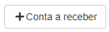

#### **Campos para Cadastro :**

* `Valor` - Insira o valor que reberá
* `Data de Vencimento` - Informe a data de vencimento da conta
* `Descrião` - Dê uma descrição para a conta
* `Data de Movimento` - Informe uma data para o movimento
* `Taxas/Juros` - Insira uma taxa de juros| **Caso Precise**
* `Descontos` - Insira um valor para desconto| **Caso Precise**
* `Tarifas` - Insira um valor de tarifas
* `Cliente` - Selecione um cliente
* `Contrato` - Informe o contrato do cliente que deseja fazer a cobrança
* `Carteira` - Informe uma carteira para o recebimento
* `Centro de Custo` - Selecione o centro de custo da conta
* `Forma de Recebimento` - Selecione uma forma de recebimento| **Moeda, Cheque, Boleto e etc..**
* `Categoria` - Informe o tipo de gasto / Categoria
* `Parcela da Venda` - Selecione uma pessoa
* `Recebido` - Informe se já foi recebido

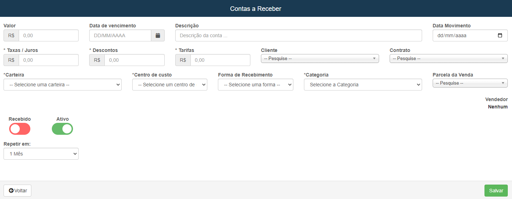
***

#### **Filtros de Pesquisa :**

1. Datas
    - `Data de Vencimento Inicio` - Insira uma data mínima para a pesquisa por dara de vencimemnto
    - `Data de Vencimento Final` - Informe uma data máximas para o vencimento
    - `Data de Recebimento Inicial` - Selecione uma data mínima dos recebimentos
    - `Data de Recebimento Final` - Insira uma data máxima dos recebimentos
    - `Data de Movimento Inicial` - Selecione uma data mínima para a pesquisa
    - `Data de Movimento Final` - Informe uma data máxima
2. Outros Campos
    - `Forma à Receber` - Insira qual é a forma de recebimeto da conta que deseja| **Moeda, Cheque, Boleto e etc...**
    - `Valor Inicial` - Insira uma valor mínimo para das contas
    - `Valor Final` - Informe o valor máximo das contas que desejá procurar
    - `Forma Recebida` - Selecione a forma que o pagamento foi recebido| **Moeda, Cheque, Boleto e etc...**
    - `Carteira` - Informe a carteira da conta que deseja procurar
    - `Palavra Chave` - Insira uma palavra chave para a busca
    - `Vendedores` - Informe o vendedor
    - `Situação` - Informe qual é a situação da conta| **Todos, Recebido e Em Abertos**
    - `Status` - Informe o status da conta| **Ativas ou Inativas**

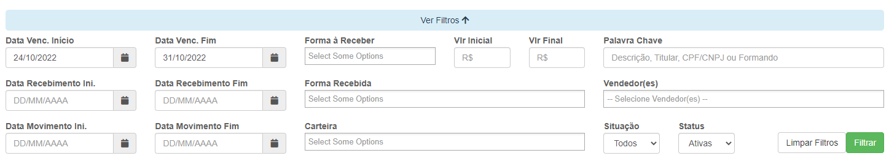
***
 

## Listagem das Contas

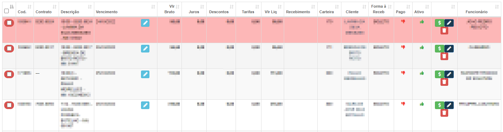

* **Contas que estiverem em vermelho significa que o pagamento está atrasado**

## Recebimento de Conta

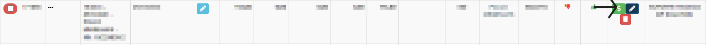

* **Logo após clicar você será redirecionado ao uma nova abá**
* **Vá em adicionar para o recebimento ser feito**

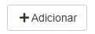

#### **Campos para cadastro**

* `Data do Pagamento` - Insira a data de quando ocorreu o pagamento
* `Valor Recebido` - Insira qual foi o valor recebido
* `Valor de Taxas e Juros` - Informe o valor da taxa de juros| **Caso Precise**
* `Valor do desconto` - Informe o valor do desconto| **Caso for preciso**
* `Cliente` - Selecione o cliente do recebimento
* `Forma de Pagamento` - Selecione qual foi o meio de pagamento
* `Carteira` - Informe a carteira do recebimento
* `Observações` - Insira uma observação| **Campo não obrigatório**

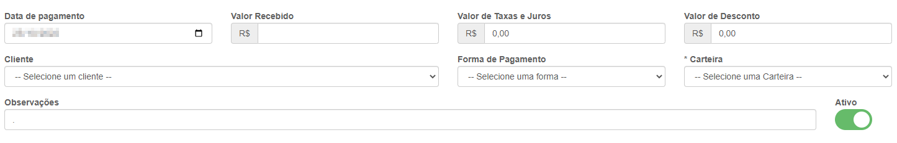
***

## **Movimentar**
**Campo com a função de alterar a carteira ou o fornecedor da conta**
***

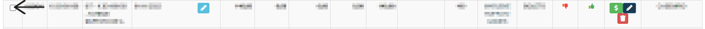

* **Selecione as contas que deseja movimentar, logo após clique em movimentar**

* **Após isso uma nova abá surgirá com as opções**
***
* `Carteira` - Selecione a carteira que deseja movimentar
* `Vale` - Informe para qual fornecedor deseja movimentar

*** 

## **Baixar**
**Opção para facilitar a confirmação do recebimento**
***

* **Selecione uma conta e depois clique em baixar. O recebimento sera cadastrado**

***

## **Inativar**
**Opção com a função de inativar contas**
***

* **Selecione a conta que deseja inativar**

* **Após isso clique na opção inativar**

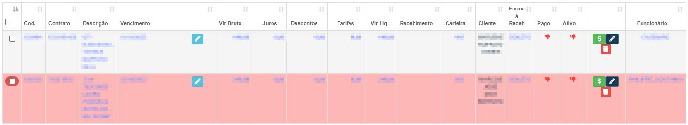

* **Contas Inativas**
***

## **Importar Vendas**
**Opção com a função de importar uma venda, caso deseje basta apenas clicar no botão e selecionar as vendas que deseja importar**
***

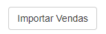

* `Centro de Custo` - Informe o centro de custo da venda
* **Selecione a Venda**

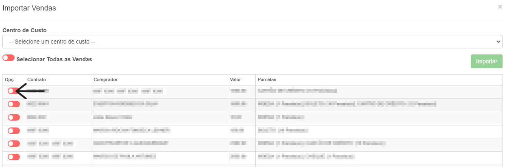
***

## **Gerar Boleto**
**Opção de gerar boletos**
***

* **Para gerar o boleto a carteira e a forma de pagamento devem estar correto**

**Despois de conferir a conta, seleione a conta que deseja gerar o boleto**

  
**Contas que a borda estão em vermelho, um boleto já foi gerado**

   
**Contas que a bordas esntão amarelas, já foram recebidas**
***

## **Sicronizar conta**
**A opção tem a função de sincronizar a o banco da conta que foi selecionada**
***

**Selecione uma conta que deseja sicronizar com o banco e gerar um boleto**

