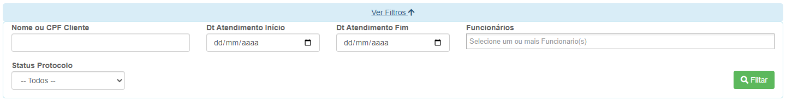
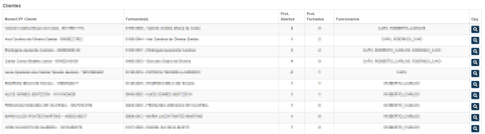
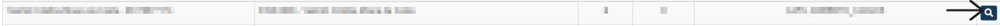

# Relatório de Cobranças
**Campo com a função de gerenciar clientes que foram atendidos**

#### **Campos para filtragem**

* `Palavra Chave` - Insira uma palavra chave para facilitar a procura
* `Data de Antendimento Inicio` - Insira uma data mínima do atendimento 
* `Data de Atendimento Fim` - Insira uma data máxima do atendimento
* `Funcionarios` - Informe o funcionario que fez o atendimento
* `Status Protocolo` - Informe o status do protocolo| **Abertos e Finalizados**

***

### **Listagem de Clientes**

***

### **Visualizar Cobrança**
