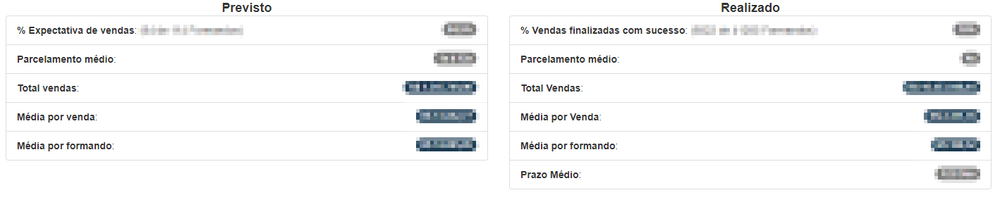

# Relatório Geral
**Campo com a função de exibir dados de custos e lucros para a análise**
***

#### **Campos para filtro**:

* `Temporada` - Selecione a temporada que deseja análisar
* `Situação` - Informe a situação do contrato| **Aprovado, Em Execução, Pré Aprovado e etc...**
* `contratos` - Selecione o contrato que deseja análisar

### Análise de Resultados
**Tabela com a função de análisar o resultados dos contratos**

### Receitas
**Tabela com a função de exibir as receitas dos contratos para análise**

* **Ao clicar na tabela uma nova tabela sugirá**

### Despesas
**Tabela com o objetivo de exibir o total de despesas**

***
 

#### Contratuais

***
 
#### Operacionais

***
 

#### Fabricação de Produtos

***
 

#### Vendas

