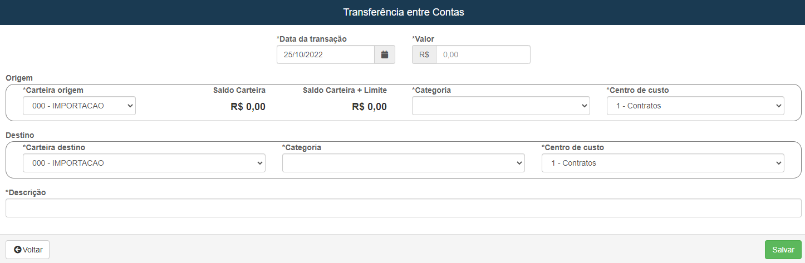

# Transfêrencia Entre Contas
**Campo com a função de exercer transferencias entre contas**
***

### Nova Transfêrencia

#### **Campos para preencher :**

* `Data da Transação` - Insira a data da transação 
* `valor` - Insira um valor pra a tranfêrencia
***
1. Origem
    - **Conta onde o dinheiro sera deslocado**
    * `Carteira Origem` - Selecione a carteira de origem para a transfêrencia
    * `Saldo Carteira` - Saldo da Conta
    * `Saldo Carteira + Limite` - Saldo da conta + o limite
    * `Categoria` - Informe o tipo da categoria da conta
    * `Centro de Custo` - Informe o centro de custo
2. Destino
    - **Conta do destinatário**
    * `Carteira Destino` - Informe a carteira de destino
    * `Categoria` - Selecione o tipo de categoria
    * `Centro de Custo` - Selecione o centro de custo
***
* `Descrição` - Dê uma descrição para a transfêrencia

***

### **Listagem de Transfêrencia :**
 

