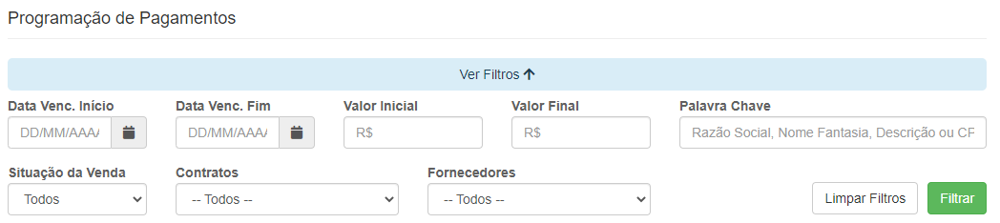
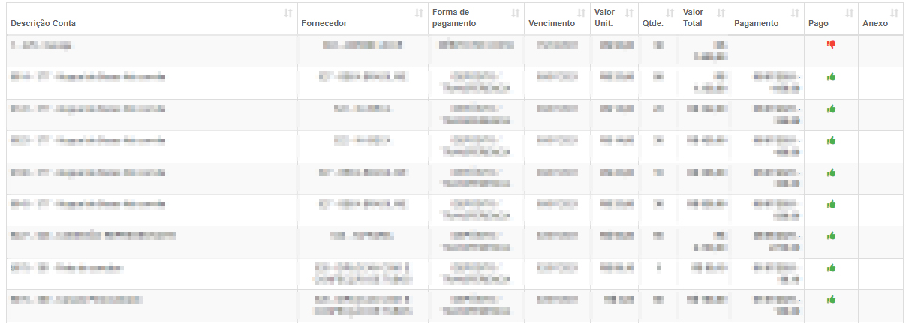

# Programação de Pagamentos
**Tabela com a função de exibir pagamentos já cadastrado**
***

### Filtro de pesquisa

***
#### **Campos para pesquisa**:

* `Data de Vencimento Inicial` - Insira uma data de início para o vencimento do produto que deseja procurar
* `Data de Vencimento Final` - Selecione uma data final para o vencimento do produto que deseja procurar
* `Valor Inicial`- Insira um valor mínimo para a pesquisa do produto
* `Valor Final` - Insira um valor máximo para a pesquisa do produto
* `palavra-chave` - Informe uma palavra-chave para facilitação de procura do produto
* `Situação da venda` - Informe a situação do pragamento| **Pago e Em Abertos**
* `Contratos` - Informe o contrato do produto
* `Fornecedores` - Selecione o fornecedor do produto
 

