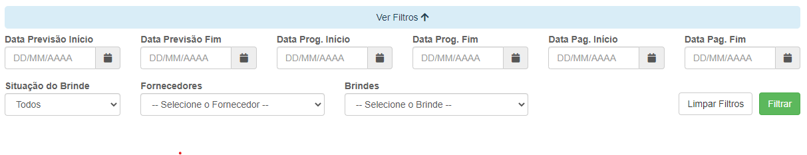
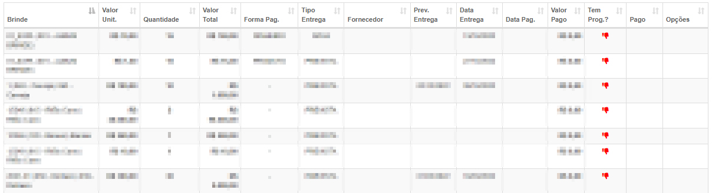

# Custo de Contratos
**Tabela com função de exibir custos de contratos**
***

### Filtro de Pesquisa

***
#### **Campos para pesquisa**:

* `Data` - Insira as datas que deseja procurar
* `Situação do Brinde` - Informe a situação do pagamento do custo| **Pago ou a Pagar**
* `Fornecedores` - Selecione o fornecedor
* `Brindes` - Escolha o brinde que deseja procurar
 

