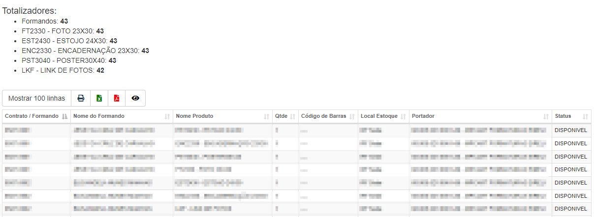

# Relatório de Produtos
**Campo com a função de exibir todos os produtos de todos os contratos ou apenas um em expecifico**
***

#### **Campos para filtro**:

* `Contrato` - Contrato que deseja procurar
* `Local de Estoque` - Local de estoque
* `Portador` - Fornecedor / Vendedor dos produtos
* `Status Produto` - Status dos produtos que deseja procurar
 

#### Resultado de uma pesquisa

