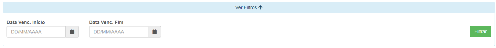
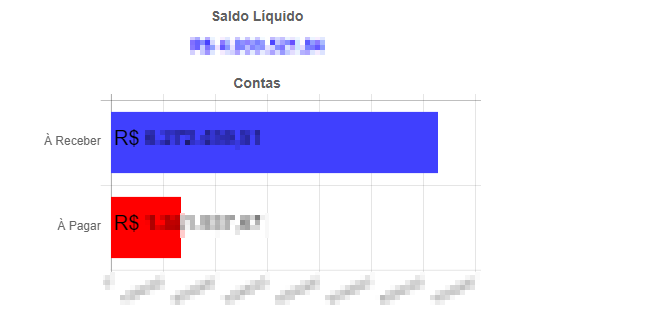
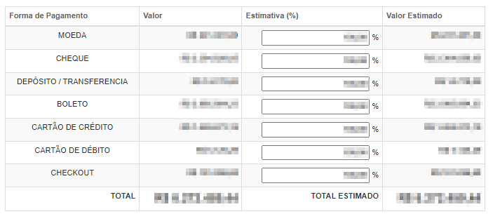
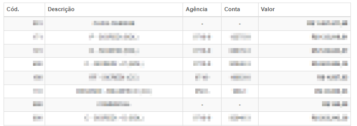
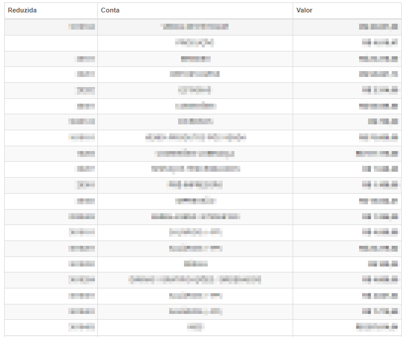
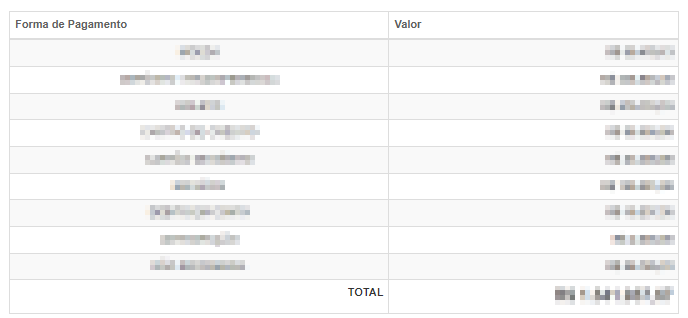
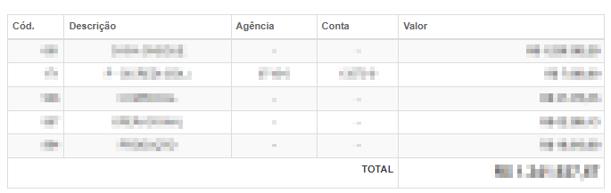

# Provisionamento Financeiro
**Campo com a função de analisar contas A Receber e contas a Pagar**
***

#### **Campos para Pesquisa :**

* `Data de Vencimento Inicial` - Insira uma data de vencimento mínima
* `Data de Vencimento Final` - Informe uma data de vencimento máxima

***
 

### **Gráfico de Análise**

**Clique no Gráfico e novas Abas irão aparecer**

#### **Contas A Receber por Forma de Pagamento**

***

#### **Contas A Receber por Carteira**

***

#### **Contas a Pagar por Contas Contábeis**

***

#### **Contas a Pagar por Forma de Pagamento**

***

#### **Contas a Pagar por Carteira**

***
