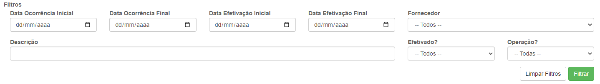
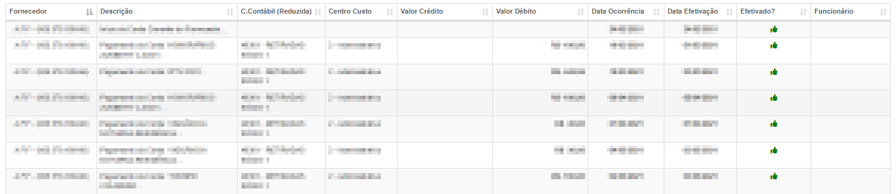

# Relatório de Conta Corrente
**Campo com a função de exibir um relatório de extratos de contas correntes**
***

#### **Campos para filtragem :**

* `Data Ocorrência Inicial` - Informe uma data mínima da ocorrência de extratos
* `Data Ocorrência final` - Informe uma data máxima da ocorrência de extratos
* `Data Efetivação Inicial` - Insira uma data mínima de efetivação do extrato
* `Data Efetivação Final` - Insira uma data máxima de efetivação do extrato que procura
* `Fornecedor` - Selecione o fornecedor da conta
* `Descrição` - Insira uma descrição para a conta
* `Efetivado` - Informe se a conta está efetivado| **Não Efetivado e Efetivado**
* `Operação` - Informe a operação da conta| **Débito ou Crédito**

### **Listagem de Contas :**

