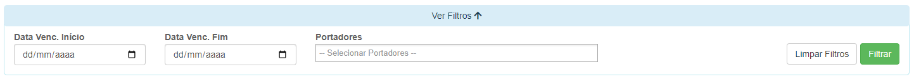
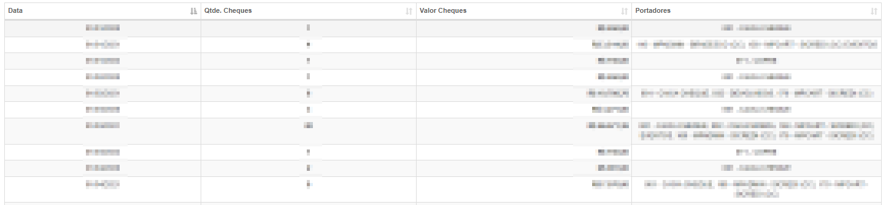

# Recebimentos de Cheques
**Campo com a função de analisar cheques cadastrados**
***

#### **Campos para filtro :**

* `Data de Vencimento Inicial` - Insira uma data mínima de vencimentos para os cheques que procura
* `Data de Vencimento Final` - Insira uma data de vencimento máximo para os chques que procura
* `Portadores` - Selecione uma carteira já cadastrada

***
 

### **Listagem de Cheques :**
 
