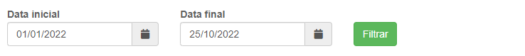
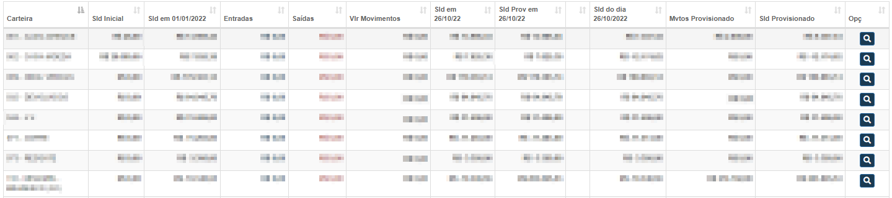

# Saldo de Carteiras
**Campo com a função de análisar o saldo das carteiras**
***

#### **Campos para pesquisa :**

* `Data Inicial` - Insira uma data mínima para a pesquisa das carteiras
* `Data Final` - Insira uma data máxima para a pesquisa das carteiras

***

### **Listagem de Carteiras**

***
 

[Visualizar Carteira](https://rfsolutionit.github.io/myphotos/pages/outros/mov-financeiro.html)

**Visualizar carteira te leva diretamente para a página de movimento financeiro**