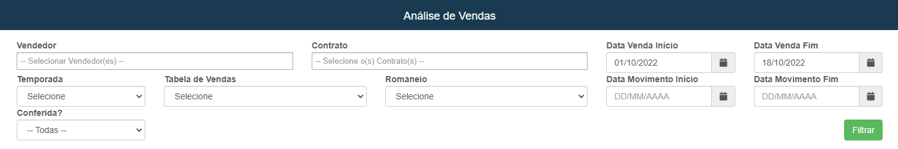

# Análise de Vendas
**Campo com a função de exibir uma tabela para gerenciar a vendas de certo vendedor**
***

#### **Campos para pesquisa**:

* `Vendedor` - Insira o vendedor que desejá procurar
* `Contrato` - Informe o contrato que o vendedor trabalhou
* `Data de início das Vendas` - Informe a data inicial das vendas
* `Data Final das Vendas` - Insira a data fina das vendas
* `Temporada` - Escolha a temporada para análise das vendas na época
* `Tabela de Vendas` - Informe a tabela de vendas que deseja analisar
* `Romaneio` - Informe o romaneio 
* `Data de início do Movimento` - Informe a data de início do movimento
* `Data final de Movimento` - Informe a data final de movimento
* `Conferida` - Informe se está conferida| **Conferida ou Não Conferida**

 
 