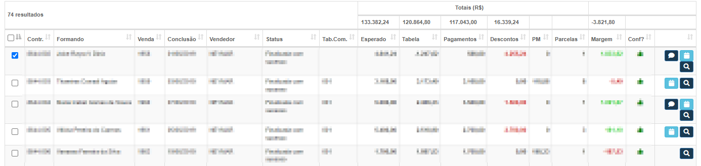
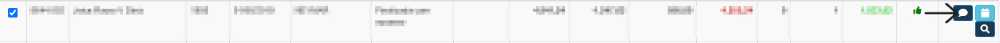
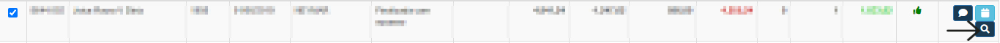
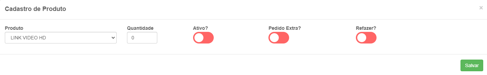

# Listagem de Vendas
**Campo com a função de gerenciar e exibir a lista de vendas**
***

#### **Campos para pesquisa**:

* `Contrato` - Selecione o contrato que deseja pesquisar
* `Escala de Vendedores` - Selecione a escala do vendedor
* `Status de Venda` - Informe o status da venda| **Venda em Andamento, Finalizada com sucesso e etc...**
* `Conferida` - Informe se já está conferido| **Sim ou Não**
* `Com Feedback`
* `Com Agendamento`
* `Data de Conclusão inicial` - Informe a data de conclusão inicial
* `Data de Conclusão Final` - Informe a data de conclusão final
* `Valor Previsto Inicial` - Insira o valor previsto inicialmente
* `Valor Previsto Final` - Insira o valor previsto para o final
* `Formando/Cliente` - Insira o formando/cliente
* `Valor de Venda Inicial` - Insira o valor da venda inicial
* `Valor de Venda Final` - Insire o valor da venda final
* `Data de Movimento Inicio` - Informe a data de inicio do movimento
* `Data de Movimento Fim` - Informe a data final do movimento
* `Vendedor` - Selecione o vendedor que deseja procurar
* `Tabela Comissão` - Informe a tabela de comissão do vendedor

## Alterar dados
**Função com o objetivo de alterar dados da venda de um certo formando escolhido**
***

#### **Campos para alterar**:

* `Vendedor` - Selecione o novo vendedor
* `Status da Venda` - Informe o novo status da venda
* `Tabela de Comissão` - Insira a nova tabela de comissão
* `Conferida` - Informe se a venda está ou não comferida

***
## Feedbacks da Venda
**Opção com a função de exibir o relatório de feedbacks da venda**
***

***

## Agendamento
**Objetivo de exibir um relatório de agendaas para venda de um certo formando**
***

#### **Campos com informação**:

* `Tabela de Vendas` - Nome da Tabela dessa venda
* `Contrato` - Nome do contrato
* `Formando` - Nome do formando
* `Venda` - Numero da Venda
* `Status` - Status da Venda
* `Vendedor` - Nome do vendedor
***

## Detalhes da Venda
**Opção com o objetivo de gerenciar a venda para o formando**
***

#### **Campos**:

* `Tabela de Vendas` - Tabela de vendas do formando
* `Contrato` - Contrato do formando
* `Formando` - Nome do formando
* `Venda` - Numero da Venda
* `Conferida` - Informe se a venda foi conferida 
* `Data Movimento` - Insira a data de movimento dos produtos
* `Data de Conclusão` - Insira a data de conclusão das vendas
* `Vendedor` - Insira o vendedor do contratos
* `Tabela de Comissão` - Selecione uma tabela de comissão
* [Editar Formando](https://rfsolutionit.github.io/myphotos/pages/cadastro/contrato/cadastro-de-formatura.html#cadastrar-formandos)
***

### Movimentações da Venda
**Campo com a função de mostrar o histórico de movimentação das vendas**

***

### Produtos
**Campo com a função de adicionar e gerenciar um produto na lista**

#### Novo Produto

* `Produto` - Selecione o produto 
* `Quantidade` - Informe a quantidade do produto
* `Ativo` - Informe se ele está ativo| **Em Uso**
* `Pedido Extra` - Informe se este produto é um produto extra
* `Refazer` - Informe se este produto sera refeito

#### Tabela dos produtos

**Tabela Previsto:** Valor previsto das presa pela venda

**Tabela Esperado:** Valor Espera das vendas pelo o vendedor

**Tabela Realizado:** Receita que os vendedores obtiveram

***

#### Tabela de Desconto

#### Condicões de Pagamento

### Compradores

#### Novo Comprador

##### **Campos para preencher**:

* `Papel` - Informe o papel do novo comprador| **Comprador ou Avalista**
* `Nome` - Insira o nome completo da pessoa a ser cadastrada
* `Tipo do Documento` - Informe o tipo do documento da pessoa
* `CPF/CNPJ` - Insira o numero do documento
* `Data de Nascimento` - Informe a data de nascimento do comprador
* `RG` - Informe o rg do documento
* `OG. Emissor` - Informe o orgão emissor
* `UF Org. Emissor` - Informe a unidade federa do orgão emssior
* `Sexo` - Insira o sexo do emissor
* `Nome do Pai ou Mãe` - Insira o nome completo da mãe ou do pai do comprador a ser cadastrado
* `E-mail` - Informe um email para contato
* `Telefone 1` - Insira um numero de telefone para contato| **Campo Obrigatório**
* `Telefone 2` - Insira um segundo numero de telefone para contato
* `Codigo Protocolo Serasa` - Insira o codigo de protocolo do Serasa
***
1. Endereço
    - `CEP` - Informe o CEP do comprador
    - `Logradouro` - Insira o nome da rua do comprador
    - `Numero` - Insira o numero da casa ou do apartamento
    - `Complemento` - Insira um complemento para facilitar a localização
    - `Bairro` - Informe o nome do bairro
    - `Estado` - Insira o Estado de moradia do comprador
    - `Cidade` - Informe a cdidade de moradia do comprador
    - `Referencia` - Dê uma referencia

### Formas de Pagamento

#### Novo Pagamento

##### **Campos para o cadastro**:

* `Metodo de Pagamneto`
1. Moeda
    - `Valor` - Insira o valor do pagamento
2. Cheque
    - `Nome do Titular` - Informe o nome do titular
    - `CPF/CNPJ` - Insira o numero do documento
    - `Banco` - Informe o banco da pessoa
    - `Agencia` - Informe a agencia da pessoa
    - `Agência DV` - Insira o Dv da agencia da pessoa
    - `Conta` - Informe a conta da pessoa
    - `Conta DV` - Insira o Dv da conta
    - `Selecione a Quantidade de Cheques` - Selecione a quantidade de cheques para o pagamento| **De 1 a 24 Cheques**
3. Cartão de Crédito
    - `Nome Titular` - Informe o nome titular da pessoa
    - `CPF / CNPJ` - Insira o numero do CPF ou CNPj da pessoa
    - `Valor` - Insira o valor do pagamento
    - `Parcelas` - Insira um numero de parcelas para o pagamento
    - `Codigo Protocolo` - Informe o codigo de protocolo
    - `Código Maquininha` - Informe o codigo da maquininha
    - `Data Hora Ocorrência` - Insira a data e a hora da operação
4. Desconto
    - `Valor` - Valor do pagamento
5. Boleto
    - `Nome Titular` - Insira o nome titular
    - `CPF / CNPJ` - Insira o nome do CPF / CNPJ
    - `Selecione a Quantidade de Boletos` - Selecione a quantidade de boletos para o pagamento| **De 1 a 24 Boletos**

**OBS Empresa: Observações são exibida apenas para a empresa**

**OBS Recibo: Observação são exibidas para todos incluindo o cliente**

