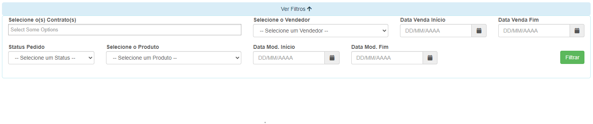

# Pedido Extra
**Campo com a função de exibir pedidos extras e suas informações**
***

#### **Campos para pesquias**:

* `Selecione o Contrato` - Selecione o contrato que deseja procurar para analise
* `Selecione o Vendedor` - Selecione o vendedor dos produtos
* `Data de Inicio da Venda` - Informe a data inicial das vendas
* `Data Final da Venda` - Informe a data final das vendas
* `Status do Pedido` - Selecione o status do Pedido
* `Selecione o Produto` - Selecione o produto que desejá procurar
* `Data Inicial da Movimentação` - Informe a data de inicio da movimentação
* `Data Final da Movimentação` - Informe a data final da movimentação

 
 
 