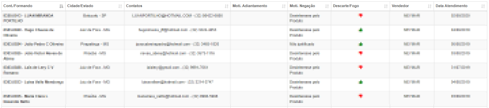

# Relatório de FeedBacks
**Campo com a função de exibir o feedback dos vendedores**
***

#### **Campos para filtro**:

* `Vendedor` - Selecione o vendedor que deseja procurar
* `Contrato` - Selecione o contatro que deseja procurar
* `Estado` - Selecione o estado onde ocorreu a venda 
* `Cidade` - Selecione a cidade onde ocorreu a venda 
* `Data de Atendimento Inicio` - Insira uma data de inicio do atendimento
* `Data de Atendimento Fim` - Insira a data final do atendimento
* `Motivo negação` - Escolha um motivo para negação

 
 
 