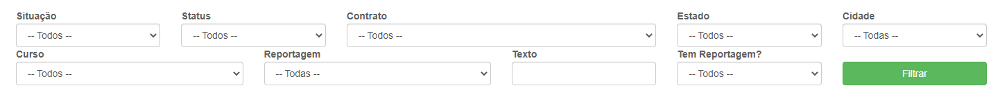
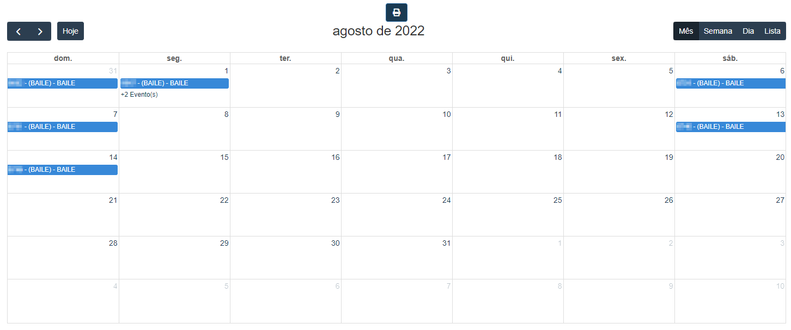

# Calendário de Eventos Internos
**Campo com a função de gerenciar a datas de eventos**
***

#### **Campos para pesquisa :**

* `Situação` - Informe qual é a situação do evento| **Previsto, Confirmado e Cancelado**
* `Status` - Insira o status do evento| **Inativo, Programado, Executando e etc..**
* `Contrato` - Selecione o contrato do evento que deseja procurar
* `Estado` - Informe o estado que o evento ocorrerá
* `Cidade` - Informe a cidade em que o evento ocorrerá
* `Curso` - Informe o curso do contrato
* `Reportagem` - Selecione a data da reportagem
* `Texto` - Insira uma palavra chave para facilitar a procura
* `Tem Reportagem?` - Informe se já ocorreu uma reportagem no evento| **Sim ou Não**

***

### **Calendário :**
**Um Exemplo de como os eventos aparecem no calendario**
***
