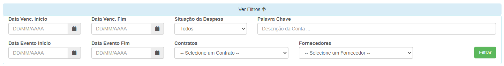
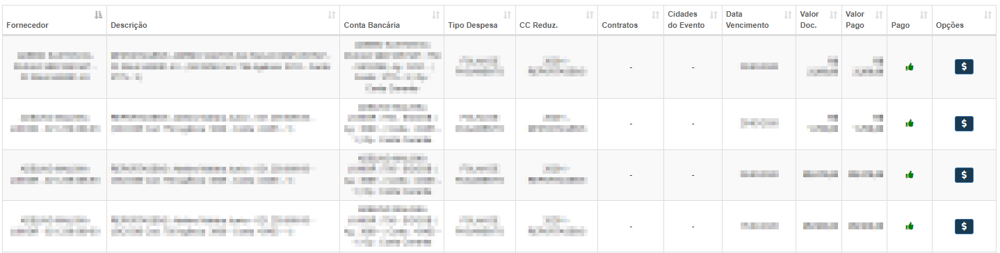

# Programação de Pagamentos
**Campo com a função contas e cadastrar pagametos**
***

#### **Campos para pesquisa :**

* `Data de Vencimento Inicio` - Insira uma data mínima de vencimeto
* `Data de Vencimento Fim` - Insira uma data máxima de vencimento
* `Data Evento Inicio` - Data mínima de inicio do evento
* `Data Evento Fim` - Data máxima de inicio do evento
* `Situação da Despesa` - Selecione a situação da despesa| **Paga ou Em Aberta**
* `Palavra Chave` - Insira uma palavra chave para faciliar a pesquias
* `Contratos` - Informe o contrato em que o fornecedor que deseja procurar trabalha
* `Fornecedores` - Informe qual fornecedor deseja procurar

***

### **Listagem de despesas**

[Realizar Pagemento](https://rfsolutionit.github.io/myphotos/pages/outros/pagar.html#pagar-conta)