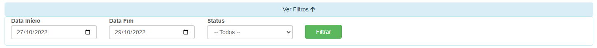
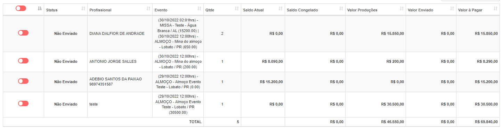
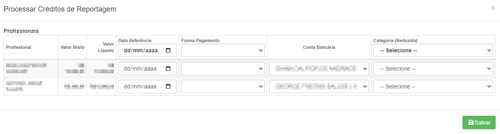

# Relatório de Reportagens
**Campo com a função de gerenciar o relatório de pagamentos de reportagens**
***

#### **Campos para filtragem :**

* `Data de início` - Insira uma data mínima para a pesquisa
* `Data Final` - Insira uma data máxima para a pesquisa
* `Status` - Informe o status da reportagem| **Enviado ou Não Enviado**

***
 

### **Listagem de Pagamentos**
 

* `Status` - Status dos pagamentos| **Enviado e Não Enviado**
* `Profissional` - Nomes dos profissionais
* `Evento` - Nome do evento em que os profissionais trabalharam
* `Quantidade` - Quantidade de eventos que o profissional trabalhou
* `Saldo Atual` - Valor do saldo atual na conta do profissional
* `Saldo Congelado` - Saldo da reportagem não concluída
* `Valor Produção` - Valor gasto no trabalho
* `Valor Enviado`  - Saldo gasto no trabalho enviado para contas a pagar
* `Valor a Pagar` - Valor gasto que ainda não foi enviado para o contas a pagar

**Apenas reportagens finalizadas aparecerão**
***

### **Realizar Pagamentos**
**Selecione aqueles que deseja realizar o pagamento**
***

#### **Campos para preencher :**

* `Data Referência` - Informe a data de realização do pagamento
* `Forma de Pagamento` - Selecione um meio de pagamento| **Moeda, Cheque, Boleto, etc.**
* `Conta Bancária` - Informe a conta bancária do profissional
* `Categoria (Reduzida)` - Selecione o tipo de custo

