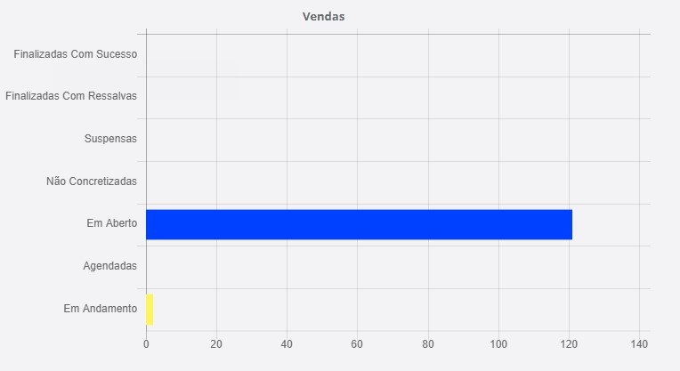

# Análise de Vendas
**Campo com a função de analisar as situações das vendas e pagamentos**
***

**A imagem acima é apenas para demonstração com dados de venda de um vendedor genérico**
***

#### **Campos**

* `Finalizadas com Sucesso` - Vendas que foram finalizadas sem nenhum problema
* `Finalizadas com Ressalvas` - Vendas que forma finalizadas com algum problema
* `Suspensa` - Vendas que forma suspensa
* `Não Concretizadas` - Venda que não forma concretizadas
* `Em Aberto` - Vendas que ainda em aberto
* `Agendadas` - Venda que estão agendada
* `Em Andamento` - Vendas estando em andamento, mas não finalizadas
