# Contratos
**Este campo tem a função de listar e aprovar vendas**
***

## Aprovar vendas
**Selecione um cliente e siga os passos**
***
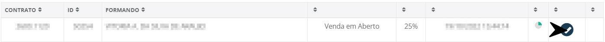

**Clique nesta opção para começar o processo. Ao entrar, uma Aba aparecera com informações do cliente**

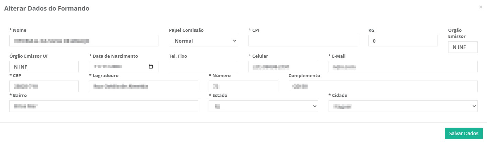

#### **Todos os campos :**

* `Nome` - Nome do formando
* `Papel Comissão` - Papel de comissão do formando
* `CPF` - CPF do formando
* `RG` - Número do RG do formando
* `Órgão Emissor` - Órgão Emissor do documento
* `Órgão Emissor UF` - Unidade Federativa do Órgão emissor
* `Data de Nascimento` - Data de nascimento do formando
* `Tel Fixo` - Telefone fixo do cliente
* `Celular` - Número de celular do formando
* `E-mail` - E-mail de contato do formando
***
1. Endereço
    - `CEP` - CEP de endereço do formando
    - `Logradouro` - Nome da rua de moradia do formando
    - `Número` - Número da casa ou apartamento de moradia
    - `Complemento` - Complemento para facilitar a busca do formando 
    - `Bairro` - Nome do bairro do formando
    - `Estado` - Estado de moradia do formando
    - `Cidade` - Cidade de moradia de formando

**Após salvar novas informações aparacerá**
***
### **Informações do aluno**

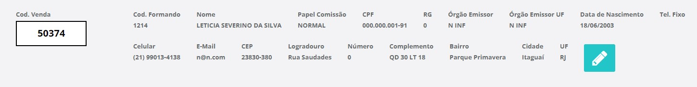

***

## Etapas do Processo de venda

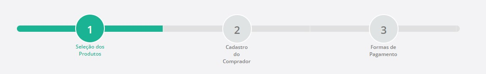

**O processo de venda é divido em três etapas**

* `Seleção dos Produtos` - Informa quais produtos o formando comprou
* `Cadastro do Comprador` - Campos responsável por informar os dados do comprador
* `Formas de Pagamento` - Inserir a formas de pagamento

***
## **Produtos**
**Campo visando gerenciar as vendas do cliente**
***

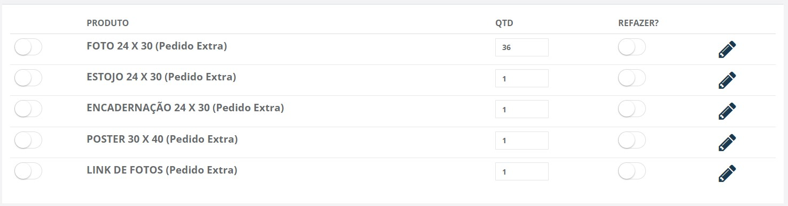

* `Primeira opção` - Assinale a opção caso o cliente tenha comprado o produto
* `Produto` - Nome do produto a ser vendido
* `Quantidade` - Quantidade do produto 
* `Refazer?` - Informe se é preciso refazer o produto
***
1. Refazer
    - **Após marcar esta opção uma nova Aba aparecerá**
    - `Quantidade a Refazer` - Insira a quantidade de produtos que será refeito
    - `Motivo` - Informe qual é o motivo do problema
    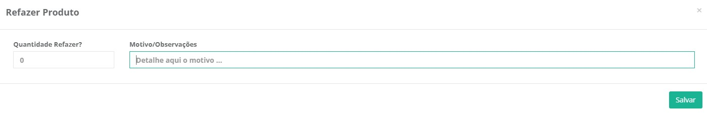

**!! Neste exemplo desconsidere os pedidos serem pedidos extras**

### **Editar Produto**

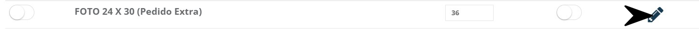

***

## Condição de Pagamento
**Após selecionar os produtos que o formando comprou, o valor será calculado e exibido aqui**
***

#### **Campos**

* `Valor Total Produtos` - Valor total das somas dos produtos que o cliente comprará
* `Valor Recibo` - Insira o valor que o cliente pagou
* `Quantidade de Parcelas` - Informe em quantas parcelas será a venda

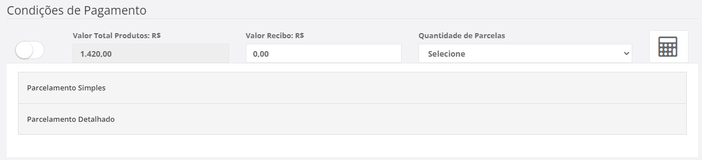

### **Parcelamento Simples**
**Está opção demonstra como funciona a taxação da empresa**

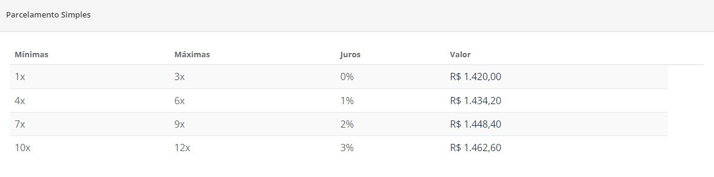

### **Parcelamento Detalhado**
**Está opção demonstra maneiras de parcelamento**

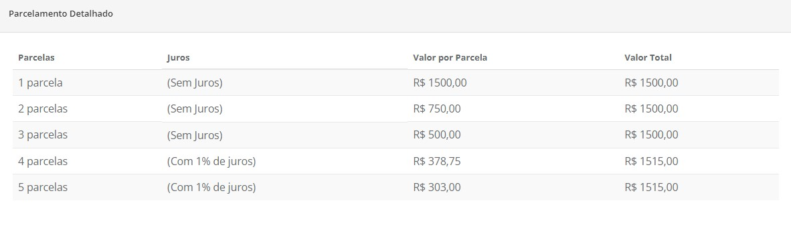
***

## Cadastro do Comprador
**Campo com a função de cadastrar informações do comprador**
***

### **Cadastrar Comprador**

#### **Campos para preencher:**

* `Papel` - Informe qual é o papel da pessoa que deseja cadastrar| **Comprador e Avalista**
* `Nome` - Insira o nome da pessoa a ser cadastrada
* `Tipo do Documento` - Informe qual é o documento da pessoa
***
1. CPF
    - `Número do Documento` - Insira o número do documento da pessoa
    - `Data de Nascimento` - Informe a data de nascimento da pessoa a ser cadastrada
    - `RG` - Insira o número do RG da pessoa que deseja cadastrar
    - `UF Org. Emissor` - Insira a unidade federal do órgão emissor do documento
    - `Sexo` - Informe o sexo da pessoa a ser cadastrada
    - `Nome do Pai ou Mãe` - Insira o nome do pai ou da mão da pessoa 
2. CNPJ
    - `Número do Documento` - Insira o número do documento do cnpj
***
* `E-mail` - Informe um E-mail para contato com o comprador a ser cadastrado
* `Telefone 1` - Insira um Número de telefone para o contato| **Campo obrigatório**
* `Telefone 2` - Insira um segundo número de telefone para contato
* `Cod. Protocolo Serasa` -
* `Referência` - 
* **Endereço**
    - `CEP` - Insira o CEP do comprador a ser cadastrado
    - `Logradouro` - Insira o nome da rua da pessoa 
    - `Número` - Insira o número da casa da pessoa que está sendo cadastrada
    - `Complemento` - Insira um complemento para facilitar a procura
    - `Bairro` - Insira o nome do bairro da pessoa a ser cadastrada
    - `Estado` - Insira o Estado de moradia da pessoa
    - `Cidade` - Informe a cidade de moradia da pessoa 

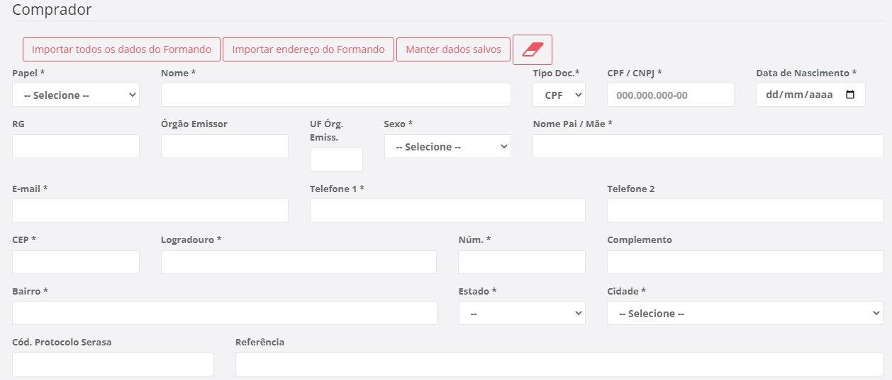

* `Importar Dados do Formando` - Caso o formando se já o próprio comprador clique nesta opção
* `Importar Endereço do Formando` - Para caso a pessoa a ser cadastrada more com o formando clique nesta opção

***
## Nova Forma de Pagamento
**Após avançar e cadastrar um comprador, este campo tem a função de cadastrar formas de pagamento para o comprador**
***

### **Valores**

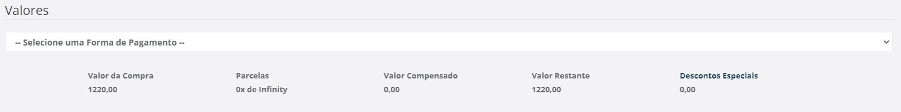

#### **Todos os Campos**

* `Primeiro Campo` - Selecione o número de parcelas para o pagamento
* `Valor da Compra` - Valor que será gasto na compra
* `Parcelas` - Número de parcelas que foi selecionado
* `Valor Compensado` - Valor que já foi inserido
* `Valor Restante` - Diferença entre o valor compensado e o valor da conta
* `Desconto Especiais` - Valor de descontos

### **Nova Forma de Pagamento**

#### **Campos para cadastro:**

1. **Boleto**
    - `Nome do Titular` - Insira o nome do titular que faze rá o pagamento
    - `CPF / CNPJ` - Insira o CPF ou CNPJ da pessoa
2. **Cartão de Débito**
    - `Comprador` - Informe o nome do comprador dono do cartão
    - `CPF / CNPJ` - Insira o CPF ou CNPJ do comprador 
    - `Valor` - Insira o valor que será pago
    - `Parcelas` - Número de parcelas
    - `Número da Autorização` - Insira o número de autorização do cartão
    - `Código Maquininha` - Insira o número do Código da Maquininha da venda
    - `Data e Hora do pagamento` - Informe a data e a hora que houve o pagamento
3. **Cartão de Crédito**
    - `Comprador` - Insira o nome do comprador dono do cartão
    - `CPF / CNPJ` - Informe o número do CPF ou CNPJ do comprador
    - `Valor` - Insira o valor que será pago
    - `Parcelas` - Informe o número das parcelas que será pago
    - `Número da Autorização` - Insira o número de autorização do cartão
    - `Código da Maquininha` - Informe o número da Maquininha que houve o pagamento
    - `Data e Hora da Ocorrência` - Insira a data e a hora de ocorrência do pagamento
4. **Cheque**
    - `Nome do Titular`- Informe o nome do titular
    - `CPF / CNPJ` - Insira o número do CPF ou do CNPJ do documento
    - `Banco` - Insira o nome do banco em que o cheque cairá
    - `Agência` - Insira o número da agência do seu banco
    - `Agência DV` - Informe o digito verificador da agência do seu banco
    - `Conta` - Informe o número de sua conta
    - `Conta DV` - Informe o digito verificado da sua conta
    - **Não é possível inserir mais parcelas**
5. **Moeda**
    - `Valor` - Insira o valor que será pago
6. **Depósito / Transferência**
    - `Nome do Titular` - Insira o nome do titular
    - `CPF / CNPJ` - Insira o número do CPF ou CNPJ do titular
    - `Banco` - Informe o nome de seu banco
    - `Agência` - Insira o número da agência do comprador
    - `Agência DV` - Informe o digito verificador da agência 
    - `Conta` - Informe o número da conta do comprador
    - `Conta DV` - Insira o digito verificador da conta
    - `Operação` - Informe o código da operação
    - `Data Registro` - Informe a data de registro do pagamento
7. **Checkout**
    - `Nome do Titular` - Insira o nome do titular
    - `CPF / CNPJ` - Insira o número do CPF ou CNPJ do titular
    - `Valor` - Insira o valor do pagamento
    - `Parcelas` - Insira o número de parcelas
    - `Número da Autorização` - Insira o número de autorização
    - `Código da Maquininha` - Insira o código da Maquininha que houve o pagamento
    - `Data e Hora da Ocorrência` - Insira a data e a hora da ocorrência do pagamento

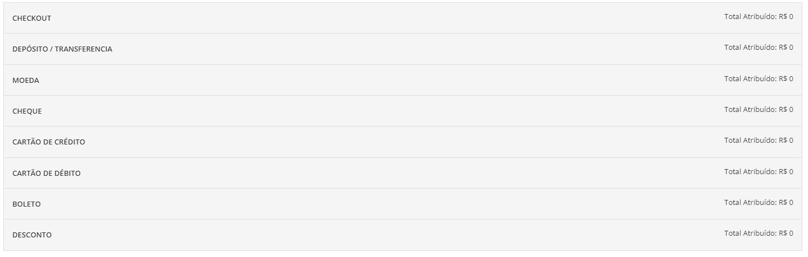
***
### **Listagem de Pagamentos**

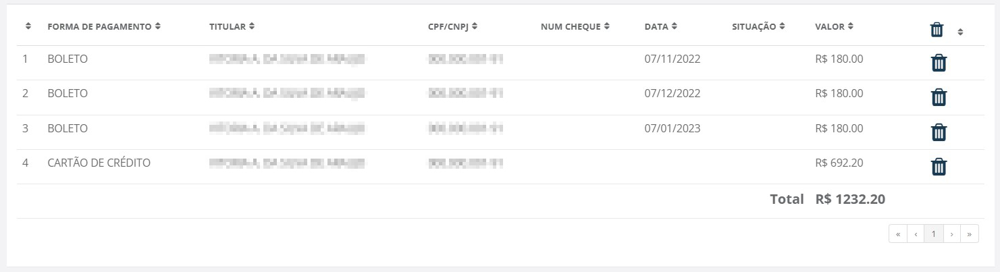

**Perceba-se que você pode cadastrar mais de uma maneira de forma de pagamento**
***

## Finalizar Vendas
**Após cadastrar as formas de pagamentos só resta finalizar a venda**
***

**Após clicar em finalizar um resumo aparecerá**

### **Produtos**

* `Contrato` - Número do contrato e nome do formando
* `Produto` - Nome dos produtos
* `Quantidade` - Quantidade de produtos comprados
* `Situação` - Situação do produto

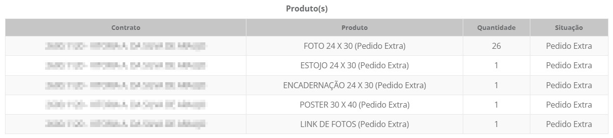
### **Comprador**

* `Papel` - Papel do Comprador| **Comprador ou Avalista**
* `Nome` - Nome do comprador
* `E-mail` - E-mail do comprador
* `CPF` - Número do CPF do Comprador 
* `Data de Nascimento` - Data de nascimento da pessoa

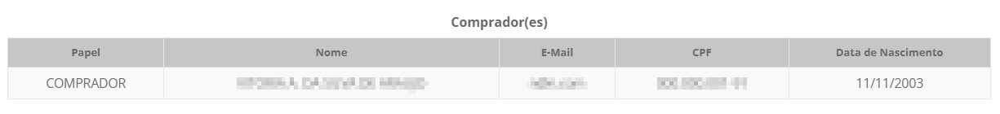
### **Pagamentos**

* `Forma de Pagamento` - Tipo da forma do pagamento 
* `Titular` - Nome do titular do pagamento
* `Valor` - Valor do pagamento
* `Data de Vencimento` - Data de vencimento do pagamento

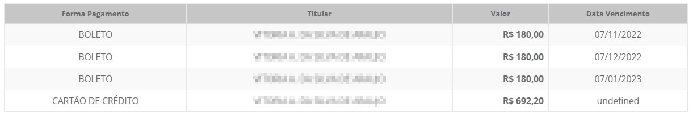

* `Fazer Consideração no Recibo` - Caso queria que as informações apareçam para o cliente assinale está opção
* `Fazer Consideração Finais Sobre a Venda` - Caso as consideração só devem ficar para o sistema e não apareça no recibo, assinale está opção

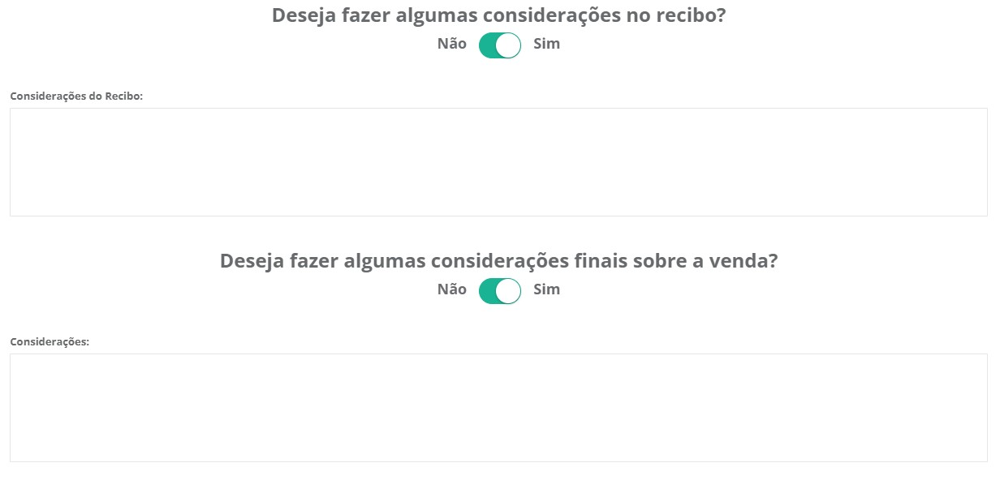

**!!! Após finalizar, a venda se conectará com o myphotos**