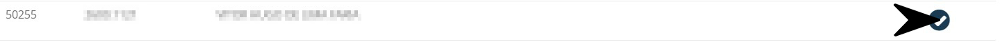

# Feedback de Venda
**Campo com a função de cadastrar feedbacks para vendas**
***

**Selecione um formando para passar feedbacks da venda**
***

### **Novo Feedback**

#### **Campos para Preencher**

* `Data` - Informe a data de chegada para a visita
* `Hora Chegada` - Insira a hora da chegada
* `Contato` - Insira uma forma de contato
* `E-mail` - Informe o E-mail para contato
* `Telefone Fixo` - Insira um número de telefone fixo para contato
* `Local de Trabalho` - Informe o loca de trabalho do formando| **Campo não Obrigatório**
* `Tipo de Endereço` - Selecione um tipo de endereço| **Família, Trabalho ou Próprio**
* `CEP` - Insira o CEP de localização
* `Logradouro` - Informe o nome da rua da localização
* `Número` - Insira o número da casa ou apartamento 
* `Complemento` - Informe um complemento para facilitar a busca
* `Bairro` - Insira o nome do bairro da localização da pessoa a ser visitada
* `Estado` - Informe o estado de localização da pessoa que está sendo visitada
* `Cidade` - Insira a cidade de moradia em que a pessoa a ser visitada vive
1. **Negativa da Compra**
    - `Motivo` - Selecione um motivo para a compra| **Mudou-se, Questões Financeiras, Não Justificado, etc.**
    - `Foi Solicitado Descarte` - Informe se foi pedido descarte para os produtos
    - `O Material foi Apresentado` - Informe se o material foi apresentado para o consumidor
* `Descrição` - Dê uma descrição para a venda

