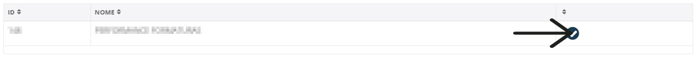

# Selecionar Empresa
**Após sincronizar a conta com o sistema do myphotos, aparacerá as empresas em que o vendedor trabalha**
***

## Sincronizar Sistema
**Caso nenhuma empresa apareça, tente sincronizar o sistema**

**Caso precise, clique neste botão ao canto esquerdo. Após isso o sistema carregará e sincronizara com o myphotos**
***

**Clique no botão de confirmar para escolher qual empresa você atenderá.**
**Após isso você será redirecionado para a Aba onde os ** [Contratos](https://rfsolutionit.github.io/myphotos/pages/vendedor/contratos.html) **estão localizados**
***

* **!!! Um Resumo, podemos dizer que a opção de sincronização é responsável por "conversar" com o Myphotos para atualizar tabelas de vendas, todas as formas, condições, escalas. E, simultaneamente, transmite todas as informações do Painel do Vendedor para o Myphotos**