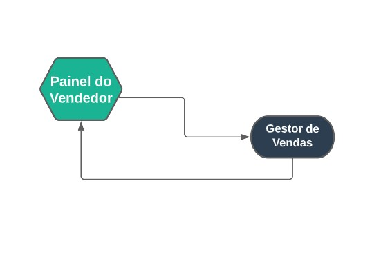

## Painel do Vendor
***
 

##### **Definições**

Permite a realização de contratos que foram realizado, e podem ser gestado na área de gestor de vendas. Neste campo exitem
a função de realizar vendas, agendar visitas ou finalizar contratos, também podendo cadastrar compradores ou avalista para 
formandos, além de cadastrar formas de pagamento para eles

Essa formas de pagamentos estão conectadas como o financeiro no myphotos, todas as formas de pagamentos cadastradas lá
irão aparecer no painel do vendedor

Já os vendedores estão relacionado ao gestor de vendas, todos vendedor cadastrado tem a opção de entrar no painel do vendedor

O Modulo do Painel do Vendedor está totalmente relacionada com a [Escala de Vendedores](https://rfsolutionit.github.io/myphotos/pages/gerenciamento/gestor-de-vendas/esc-vendedores.html) no modulo do [Gestor de Vendas](https://rfsolutionit.github.io/myphotos/pages/gestor-de-vendas.html)

##### **Caracteristacas**

* Permite a àprovação de vendas
* Permite o Agendamento de visitas
* Permite dar feedbacks para a venda
* Permite a análise de vendas do vendedor 
* Além de permitir o vendedor acompanhar o andamento das vendas
* Também permite uma análise de das formas de pagamento

##### **Visão Geral**

Ao entrar no **Painel do Vendedor** sua conta automaticamente se conectará com o myphotos, e aparecerá em quais empresas você pode
atender

Após a escolha de qual empresa você atenderá, uma abá com os formandos aparecerá, e lá você pode escolher em qual formando trabalhará,
depois de selecionar um formando você será redirecionado para uma outra abá, com informações sobre o formando e seus produtos, nesta abá 
você pode selecionar quais produtos o formando escolheu e o valor pago pelos os produtos

Ao avançar você será novamente redirecionado para uma nova abá com a função de cadatrar um comprador e seus dados

Logos cadastrar um comprador você deve adicionar uma forma de pagamento

