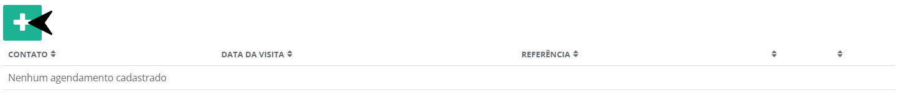
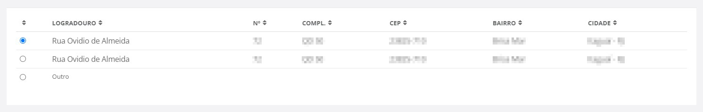
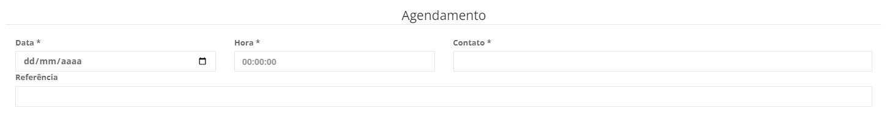

# Agendamento de Visita
**Campo com a função de criar agendamentos de vista para o formando**
***

**Selecione o formando que deseja cadastrar um agendamento para visita**
***

### **Novo Agendademnto**

#### **Campos pare preencher :**

**Selecione o local que deseja vizitar**

1. **Outro**
    - `CEP` - Insira o CEP do endereço que você visitará
    - `Logradouro` - Nome da rua do endereço
    - `Número` - Numero da casa ou apartamento 
    - `Complemento` - Insira um complemento para faciliatar a busca
    - `Bairro` - Informe o nome do bairro 
    - `Estado` - Insira o estado de localização do endereço
    - `Cidade` - Insira a cidade de localização do endereço que deseja visitar  
***

#### **Agendamento**

* `Data` - Insira a Data da visita
* `Hora` - Informe o Horario da visita
* `Contato` - Insira um meio de contato
* `Referência` - Informe uma referencia

